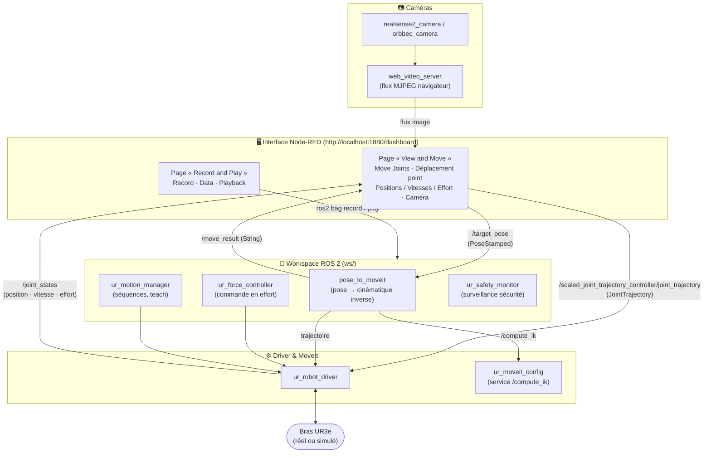

<a id="readme-top"></a>

<!-- PROJECT PRESENTATION -->
<br/>
<div align="center">
<h3 align="center">Plateforme UR3e — ROS 2 + Node-RED</h3>
  <p align="center">
    Architecture logicielle unifiée pour piloter un bras Universal Robots UR3e
    (commande articulaire, cartésienne et en effort), visualiser les caméras
    et enregistrer les données, le tout depuis une interface Node-RED pédagogique.
    <br />
  </p>
</div>

<!-- TABLE OF CONTENTS -->
<details>
  <summary>Table des matières</summary>
  <ol>
    <li><a href="#a-propos">À propos du projet</a></li>
    <li><a href="#architecture">Architecture</a></li>
    <li>
      <a href="#installation">Installation</a>
      <ul>
        <li><a href="#prerequis">Prérequis</a></li>
        <li><a href="#construction-du-workspace">Construction du workspace</a></li>
        <li><a href="#node-red">Node-RED</a></li>
      </ul>
    </li>
    <li><a href="#utilisation">Utilisation</a></li>
    <li><a href="#interface-node-red">L'interface Node-RED</a></li>
    <li><a href="#structure-du-depot">Structure du dépôt</a></li>
    <li><a href="#contact">Contact</a></li>
  </ol>
</details>

<!-- ABOUT THE PROJECT -->
<a id="a-propos"></a>
## À propos du projet

Plusieurs briques logicielles (commande en effort, commande en position/vitesse,
lecture des caméras) avaient été développées séparément autour d'un bras **Universal
Robots UR3e**. Ce dépôt les réunit dans un **workspace ROS 2 unique** et fournit une
**interface Node-RED** pensée comme un outil pédagogique : on y sélectionne les
mouvements, on visualise l'état du robot et les caméras, et on enregistre/rejoue les
données sans avoir à taper de commandes ROS.

Le projet fonctionne aussi bien avec le **robot réel** qu'en **simulation** (matériel
simulé `use_mock_hardware`), ce qui permet de l'utiliser en TP sans robot branché.

Fonctionnalités couvertes :

- **Commande articulaire** — déplacer chaque articulation par des sliders.
- **Commande cartésienne** — envoyer une pose (x, y, z + orientation) résolue par
  cinématique inverse via MoveIt.
- **Commande en effort** — contrôleur de force dédié (nœuds `ur_force_controller`,
  `ur_safety_monitor`, `ur_motion_manager`).
- **Visualisation caméra** — flux RealSense ou Orbbec affiché dans le navigateur.
- **Monitoring** — position, vitesse et effort de chaque articulation en temps réel.
- **Enregistrement / relecture** — capture et rejeu des données au format `rosbag`
  directement depuis l'interface.
- **Passerelle FANUC (TCP/KAREL)** — une page supplémentaire pilote un bras FANUC
  par communication TCP directe. Elle intègre à cette interface une brique de
  communication KAREL initialement présentée par un autre étudiant (voir
  [Page « Contrôle robot TCP »](#interface-node-red)).

<p align="right">(<a href="#readme-top">back to top</a>)</p>

<!-- ARCHITECTURE -->
<a id="architecture"></a>
## Architecture

L'interface Node-RED communique avec le robot **uniquement via des topics et services
ROS 2**. Elle ne parle jamais directement au matériel : tout passe par le driver UR et
les nœuds du workspace.



**Topics et messages principaux :**

| Topic | Type de message | Sens | Rôle |
|-------|-----------------|------|------|
| `/target_pose` | `geometry_msgs/PoseStamped` | UI → `pose_to_moveit` | Cible cartésienne |
| `/scaled_joint_trajectory_controller/joint_trajectory` | `trajectory_msgs/JointTrajectory` | UI / `pose_to_moveit` → driver | Consigne articulaire |
| `/joint_states` | `sensor_msgs/JointState` | driver → UI | Position, vitesse, effort |
| `/move_result` | `std_msgs/String` | `pose_to_moveit` → UI | Retour de la résolution IK |
| `/compute_ik` (service) | `moveit_msgs/GetPositionIK` | `pose_to_moveit` → MoveIt | Cinématique inverse |

<p align="right">(<a href="#readme-top">back to top</a>)</p>

<!-- INSTALLATION -->
<a id="installation"></a>
## Installation

Testé sur **Ubuntu 24.04** avec **ROS 2 Jazzy**.

<a id="prerequis"></a>
### Prérequis

**1. Node.js et Node-RED**

Node-RED nécessite **Node.js ≥ 22**. La version fournie par défaut par Ubuntu 24.04
(v18) est trop ancienne : on installe donc Node.js 22 via NodeSource.

```sh
curl -fsSL https://deb.nodesource.com/setup_22.x | sudo -E bash -
sudo apt install -y nodejs
sudo npm install -g node-red
```

Vérifier : `node --version` doit afficher `v22.x` ou plus.

**2. ROS 2 Jazzy** ([instructions détaillées](https://docs.ros.org/en/jazzy/Installation/Ubuntu-Install-Debs.html))

```sh
sudo apt install software-properties-common
sudo add-apt-repository universe

sudo apt update && sudo apt install curl -y
export ROS_APT_SOURCE_VERSION=$(curl -s https://api.github.com/repos/ros-infrastructure/ros-apt-source/releases/latest | grep -F "tag_name" | awk -F'"' '{print $4}')
curl -L -o /tmp/ros2-apt-source.deb "https://github.com/ros-infrastructure/ros-apt-source/releases/download/${ROS_APT_SOURCE_VERSION}/ros2-apt-source_${ROS_APT_SOURCE_VERSION}.$(. /etc/os-release && echo ${UBUNTU_CODENAME:-${VERSION_CODENAME}})_all.deb"
sudo dpkg -i /tmp/ros2-apt-source.deb

sudo apt update && sudo apt upgrade -y
sudo apt install ros-jazzy-desktop python3-colcon-common-extensions
```

**3. Driver UR, caméras et outils**

```sh
# Driver, description et configuration MoveIt Universal Robots
sudo apt install ros-jazzy-ur-robot-driver ros-jazzy-ur-description ros-jazzy-ur-moveit-config

# Caméra RealSense — https://github.com/IntelRealSense/realsense-ros
sudo apt install ros-jazzy-realsense2-camera

# Caméra Orbbec — https://github.com/orbbec/OrbbecSDK_ROS2
sudo apt install ros-jazzy-orbbec-camera ros-jazzy-orbbec-description

# Serveur vidéo pour afficher le flux dans le navigateur
sudo apt install ros-jazzy-web-video-server

# rosdep (résolution des dépendances)
sudo apt install python3-rosdep
sudo rosdep init
rosdep update
```

<a id="construction-du-workspace"></a>
### Construction du workspace

Le driver UR et sa configuration MoveIt sont fournis par les paquets apt de
l'étape précédente : le workspace ne compile donc que les nœuds propres au projet.

```sh
# 1. Cloner le dépôt
git clone https://github.com/OctaveLouvel/Stage1A.git
cd Stage1A/ws

# 2. Installer les dépendances puis compiler
source /opt/ros/jazzy/setup.bash        # ou setup.zsh selon votre shell
sudo apt update && rosdep install -r --from-paths src --ignore-src --rosdistro jazzy -y
colcon build --symlink-install
source install/setup.bash               # ou setup.zsh
cd ..
```

Packages ROS 2 compilés par le workspace (`ws/src/`) :

- `pose_to_moveit` — convertit une pose cartésienne en trajectoire articulaire via MoveIt.
- `ur_force_controller` — commande en effort du bras.
- `ur_safety_monitor` — surveillance de sécurité pendant la commande en effort.
- `ur_motion_manager` — gestion des séquences de mouvements et mode « teach ».

> Les drivers caméra (`realsense2_camera`, `orbbec_camera`) proviennent des paquets
> apt installés plus haut ; il n'est pas nécessaire de les recompiler depuis les
> sources.

<a id="node-red"></a>
### Node-RED

```sh
# Le workspace ROS 2 doit être sourcé AVANT cette étape
cd node-red
npm install
cd ..
```

<p align="right">(<a href="#readme-top">back to top</a>)</p>

<!-- USAGE -->
<a id="utilisation"></a>
## Utilisation

Un script de lancement `launcher.py` démarre les bons nœuds selon le mode souhaité,
sans avoir à mémoriser les commandes ROS.

```sh
python3 launcher.py
```

Un menu propose plusieurs **profils** :

| Profil | Nœuds démarrés | Usage |
|--------|----------------|-------|
| **NodeRed seul** | Node-RED | Ouvrir uniquement l'interface |
| **Robot seul** | Node-RED, driver UR, MoveIt, `pose_to_moveit` | Commande articulaire et cartésienne |
| **Commande en force** | Node-RED, driver UR, safety monitor, force controller, motion manager, teach | Commande en effort |
| **RealSense** | Node-RED, caméra RealSense, web video server | Visualisation RealSense |
| **Astra2** | Node-RED, caméra Orbbec, web video server | Visualisation Orbbec |
| **Tout** | Ensemble des nœuds | Démonstration complète |

> **Robot réel vs simulation** — ouvrez `launcher.py` et réglez en haut du fichier :
> `ROBOT_IP` (adresse du robot) et `USE_MOCK` (`True` = matériel simulé, aucun robot
> requis ; `False` = robot réel).

Une fois lancé, ouvrez l'interface dans un navigateur :

```
http://localhost:1880/dashboard
```

`Ctrl+C` dans le terminal du launcher arrête proprement tous les nœuds.

<p align="right">(<a href="#readme-top">back to top</a>)</p>

<!-- INTERFACE -->
<a id="interface-node-red"></a>
## L'interface Node-RED

L'interface est organisée en trois pages.

### Page « View and Move »

- **Move Joints** — un slider par articulation + `Valider` pour envoyer la consigne,
  `Home` pour revenir à la position de repos.
- **Déplacement point** — saisir une position `x / y / z` et une orientation
  (quaternion), puis `Valider` : la pose est résolue par cinématique inverse (MoveIt)
  et exécutée. Le résultat (succès / échec IK) est affiché.
- **Positions / Vitesses / Effort** — affichage en temps réel de la position, de la
  vitesse et de l'effort de chaque articulation (lecture de `/joint_states`).
- **Caméra** — bouton `Find image topics` pour lister les flux disponibles, puis
  sélection du topic à afficher (RealSense ou Orbbec via `web_video_server`).

### Page « Record and Play »

- **Record** — nommer un enregistrement, choisir les topics à capturer, puis
  `Start Recording` / `Stop Recording`. Les données sont écrites dans `bags/` au
  format `rosbag`.
- **Data** — liste des enregistrements disponibles dans `bags/`.
- **Playback** — sélectionner un enregistrement et le rejouer
  (`Playback` / `Stop` / `Pause` / `Resume`).

C'est ce module qui répond au besoin d'**enregistrement et d'exportation des données**
(états du robot, commandes, caméra) pour analyse ultérieure.

### Page « Contrôle robot TCP » (robot FANUC / KAREL)

Cette page pilote un bras **FANUC** via une communication **TCP directe** avec un
serveur écrit en **KAREL** (le langage des contrôleurs FANUC), sur le port `59002`.
Elle réutilise et intègre à cette interface une brique de communication TCP/KAREL
**présentée par un autre étudiant** : le travail de reprise a consisté à en faire une
page cohérente du tableau de bord, à normaliser le protocole d'échange et à la rendre
démontrable de manière autonome.

- **Commande** — choisir un axe (`J1`–`J6`), saisir un angle et cliquer `Envoyer` ;
  boutons `Home` (retour repos) et `Quitter` (fermeture de connexion).
- **État du robot** — affiche la réponse brute du serveur et les positions
  articulaires courantes (J1–J3 et J4–J6), avec des notifications
  *Position atteinte* / *Hors limites* / *Déconnexion*.

Contrairement à l'UR3e (piloté par ROS 2), le FANUC est ici commandé par de simples
messages texte en TCP — ce qui illustre que la même philosophie d'IHM pédagogique
Node-RED s'adapte à des robots de marques et protocoles différents.

**Protocole** (ASCII brut, sans caractère de fin de ligne côté commande) :

| Sens | Message | Signification |
|------|---------|---------------|
| IHM → robot | `Jx:angle` (ex. `J1:45`) | Déplace l'axe *x* de *angle* degrés |
| IHM → robot | `HOME` | Retour à la position de repos |
| IHM → robot | `exit` | Ferme la connexion |
| robot → IHM | `POSITION ATTEINTE;J1:v;…;J6:v` | Mouvement effectué + positions |
| robot → IHM | `HORS LIMITES;J1:v;…;J6:v` | Mouvement refusé (butée logicielle) |
| robot → IHM | `EXIT OK` | Connexion fermée |

Le serveur côté contrôleur est fourni dans `fanuc/robot_tcp_server.kl`. Pour
**démontrer la page sans robot FANUC**, un serveur de simulation Python reproduit
exactement le même protocole :

```sh
python3 fanuc/mock_karel_server.py     # écoute sur le port 59002
```

Il suffit ensuite d'ouvrir la page « Contrôle robot TCP » et d'envoyer des commandes.

<p align="right">(<a href="#readme-top">back to top</a>)</p>

<!-- STRUCTURE -->
<a id="structure-du-depot"></a>
## Structure du dépôt

```
.
├── launcher.py          # Script de lancement (menu de profils)
├── ws/                  # Workspace ROS 2
│   └── src/
│       ├── pose_to_moveit/       # Pose cartésienne → IK → trajectoire
│       ├── ur_force_controller/  # Commande en effort
│       ├── ur_safety_monitor/    # Surveillance de sécurité
│       ├── ur_motion_manager/    # Séquences de mouvements + teach
│       ├── realsense-ros/        # Driver caméra RealSense
│       └── OrbbecSDK_ROS2/       # Driver caméra Orbbec
├── node-red/            # Flows et configuration Node-RED
├── fanuc/               # Communication TCP/KAREL avec un robot FANUC
│   ├── robot_tcp_server.kl    # Serveur KAREL (côté contrôleur FANUC)
│   └── mock_karel_server.py   # Serveur de simulation (démo sans robot)
└── bags/                # Enregistrements rosbag (générés à l'usage)
```

<p align="right">(<a href="#readme-top">back to top</a>)</p>

<!-- CONTACT -->
<a id="contact"></a>
## Contact

Octave Louvel — octavelouvel@gmail.com

Encadrants (Université d'Évry — IBISC) :
- Lamri Nehaoua — lamri.nehaoua@univ-evry.fr
- Hicham Hadj-Abdelkader — hicham.hadjabdelkader@univ-evry.fr

<p align="right">(<a href="#readme-top">back to top</a>)</p>
